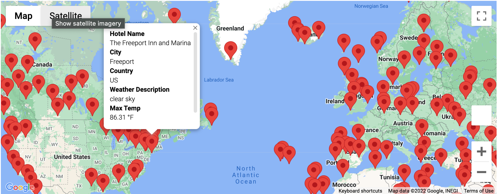
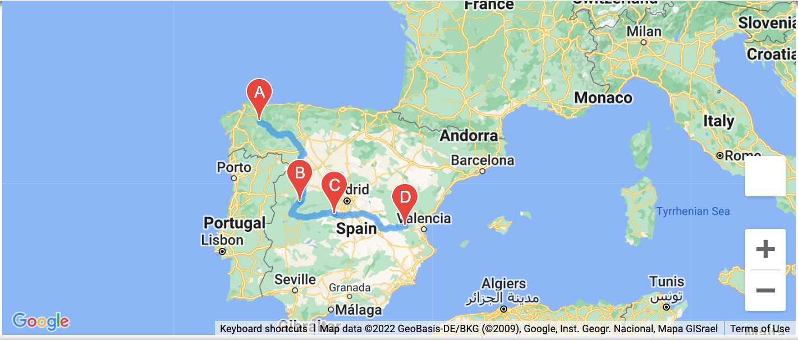
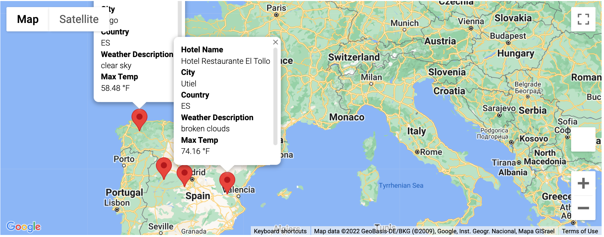

# World_Weather_Analysis

## Overview
Tourism and travel have always been a popular escape to many people, offering a glimpse into the diversity of human culture. One of the most important aspects of traveling one must take into account when planning a trip to another continent or region is the weather of the destination. The purpose of this project was to collect, analyze, and visualize weather data from cities across the world in order to provide travelers with a tool that will them make decisions about their trip based on weather conditions.

### Resources Utilized to Complete Analysis
  -Python: Python version 3.7.6; Dependencies: Pandas, Matplotlib, CitiPy, Numpy, Python Requests, API's, JSON
  
## Weather Database
  - We initially created a database of 2,000 latitudes and longitudes, which we ran an API call on and gathered weather/travel data on the nearest cities to those coordinates based on :
    - Max Temperature
    - Weather conditons I.e. "ligth rain", "Broken clouds", etc.
    - Humidity
    - Cloudiness
    - Wind speed
    - City
    - Country
    - Nearby Hotels

## Vacation Search
- Based on user input in regards to max and minimum temperatures of the destination they would like to travel too, we created a map with markers of cities that would be within their desired weather conditions.
- 
## Vacation Itenerary
- Utilizing Google Directions API, a sample travel itinerary for Spain was created for a trip from Lugo to Utiel.

